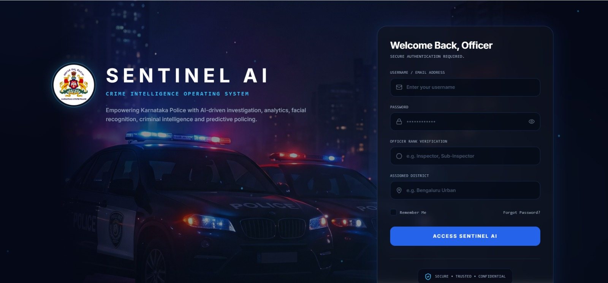
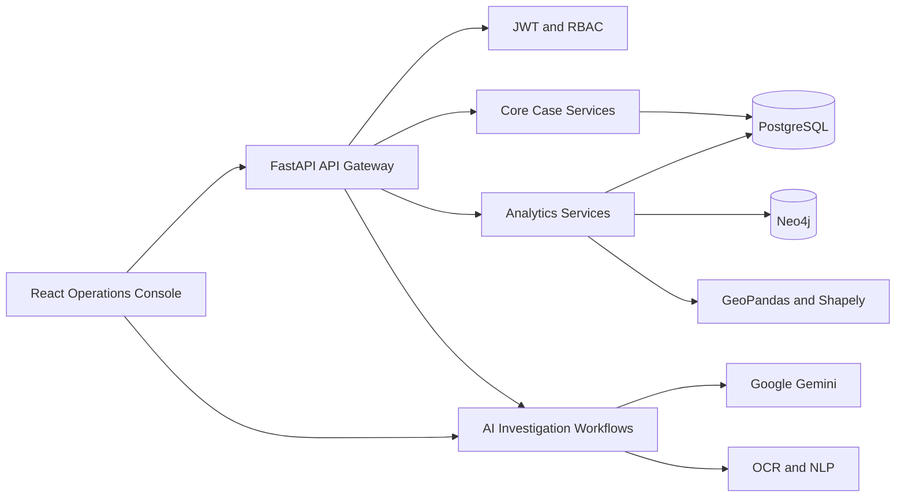
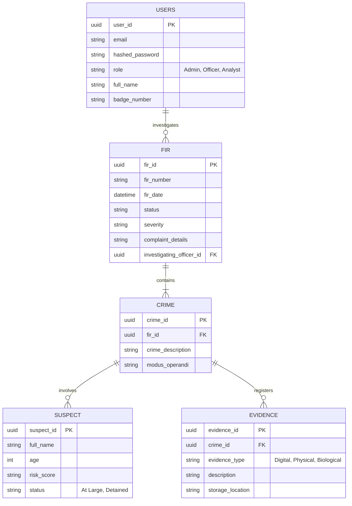

<div align="center">
  
  <h1>Vigilens</h1>
  <p><b>Next-Generation AI-Powered Crime Intelligence & Investigation Operating System</b></p>

[](https://react.dev)
[](https://fastapi.tiangolo.com)
[](https://neon.tech)
[](https://neo4j.com)
[](https://deepmind.google/technologies/gemini/)
[](https://tailwindcss.com)

</div>

<br />

<p align="center">
  <a href="#overview">Overview</a> ·
  <a href="#key-features">Key Features</a> ·
  <a href="#technology-stack">Tech Stack</a> ·
  <a href="#architecture">Architecture</a> ·
  <a href="#core-modules">Core Module</a> ·
   <a href="#key-metrics">Key Project Metrics</a> ·
  <a href="#getting-started">Getting Started</a> ·
  <a href="https://Vigilens.onslate.in">Live Demo</a>
</p>

**Vigilens** is an enterprise-grade, comprehensive Crime Intelligence platform designed for modern law enforcement and intelligence agencies. It seamlessly bridges raw operational data, geospatial analytics, graph-based criminal networks, and state-of-the-art Generative AI to accelerate case resolution and provide unprecedented tactical insights.

## Real time Crime Login Page

<p align="center">
  
</p>
---
<a id="key-features"></a>

## ✨ Key Features

| Capability                     | What it enables                                                                                                                |
| :----------------------------- | :----------------------------------------------------------------------------------------------------------------------------- |
| **AI-powered case intake**     | Extracts text and investigative entities from uploaded FIRs and evidence documents, then presents the output for review.       |
| **Multilingual intelligence**  | Translates regional-language case material and structures key entities for easier investigation.                               |
| **Crime pattern matching**     | Compares modus operandi, case details, and related signals to surface potentially linked cases.                                |
| **Criminal network analysis**  | Explores relationships between people, cases, vehicles, devices, and other intelligence entities through an interactive graph. |
| **GIS and analytics**          | Visualizes crime hotspots, geographic patterns, operational metrics, and trends for informed deployment.                       |
| **Investigation workspace**    | Keeps case summaries, evidence, suspects, timelines, actions, and officer diary entries together in one workflow.              |
| **AI investigation assistant** | Supports natural-language questions, summaries, recommendations, and voice-assisted investigation flows.                       |
| **Role-aware access**          | Uses JWT authentication and role-based permissions for administrators, officers, and analysts.                                 |

---

<a id="technology-stack"></a>

## 🧰 Technology Stack

| Layer                        | Technologies                                                         |
| :--------------------------- | :------------------------------------------------------------------- |
| **Frontend**                 | React 19, TypeScript, Vite, React Router, Tailwind CSS 4             |
| **User experience**          | Recharts, Lucide React, Lottie, React Markdown, jsPDF + AutoTable    |
| **Backend API**              | Python, FastAPI, Uvicorn, Pydantic                                   |
| **Data layer**               | PostgreSQL, SQLAlchemy, Alembic, Neon-compatible PostgreSQL          |
| **Graph intelligence**       | Neo4j                                                                |
| **AI and language**          | Google Gemini, spaCy, RapidFuzz, EasyOCR, Tesseract                  |
| **Geospatial and analytics** | GeoPandas, Shapely, Pandas, NumPy, Plotly                            |
| **Security**                 | JWT, Argon2 password hashing via `pwdlib`, role-based access control |

---



The project is heavily decentralized into four major operational domains to ensure scalability and maintainability. Each domain serves a critical function in the intelligence lifecycle.

<br>

## 🏗️ Architecture & Domain Deep-Dive

The project is heavily decentralized into four major operational domains to ensure scalability and maintainability. Each domain serves a critical function in the intelligence lifecycle.

<br>

### 🧠 1. Artificial Intelligence (AI) Domain

> _The AI domain acts as a digital force multiplier for investigating officers, automating thousands of hours of manual paperwork and data synthesis._

| Feature                                 | Technical Breakdown & Capability                                                                                                                                                                                                                                                                                                                            |
| :-------------------------------------- | :---------------------------------------------------------------------------------------------------------------------------------------------------------------------------------------------------------------------------------------------------------------------------------------------------------------------------------------------------------- |
| 🌐 **Multilingual AI Translation**      | **Breaks down regional language barriers.** <br/> Vernacular documents (FIRs in Kannada, Hindi, Marathi) are instantly translated into English using advanced LLMs. _Crucially_, the AI actively performs **Named Entity Recognition (NER)** to extract IPC/BNS Sections, Stolen Assets, and Suspect Names directly into structured PostgreSQL JSON fields. |
| 🔍 **Pattern Similarity (MO Matching)** | **Identifies serial offenders automatically.** <br/> Employs complex Natural Language Processing to scan the entire crime database. By mathematically matching _Modus Operandi (MO)_ vectors and victimology profiles, it links seemingly isolated cases across different districts.                                                                        |
| 🤖 **Interactive Case Assistant**       | **Your personal AI co-investigator.** <br/> A securely sandboxed Generative AI instance loaded with your specific case files. Ask natural language queries like _"What is the timeline of events for FIR-123?"_ or _"Cross-reference this suspect's aliases"_ and get instant, cited answers.                                                               |
| 📄 **Automated PDF Dossiers**           | **Instant Intelligence Briefs.** <br/> With a single click, the engine synthesizes raw database segments, timeline events, and AI insights into highly readable, official PDF intelligence briefs using `jsPDF`—ready for courtroom submission or senior officer review.                                                                                    |

<br>

### 🕸️ 2. Data Intelligence (Data & GIS) Domain

> _Standard relational tables struggle with complex criminal relationships. Our Data Intelligence layer maps the invisible connections between syndicates and geographies._

| Feature                              | Technical Breakdown & Capability                                                                                                                                                                                                                                                                              |
| :----------------------------------- | :------------------------------------------------------------------------------------------------------------------------------------------------------------------------------------------------------------------------------------------------------------------------------------------------------------ |
| 🔗 **Graph Network Analysis**        | **Visualize the criminal underworld.** <br/> Powered by **Neo4j Graph Database**, the system maps out organized syndicates. It draws interactive, visual links between suspects, shared vehicles, burner phones, communication nodes, and multiple FIRs.                                                      |
| 🗺️ **Geospatial Intelligence (GIS)** | **Predictive policing through heatmaps.** <br/> Leveraging Python's **GeoPandas** and **Shapely**, the system renders high-performance interactive heatmaps and geographic clusters. This allows control rooms to deploy patrol units dynamically based on historical crime density and active threat alerts. |
| 🔬 **Digital Forensics**             | **Uncover hidden digital trails.** <br/> Automatically parses raw CDRs (Call Detail Records) and IP activity logs. The system flags anomalous behavior, geo-fencing breaches, and cross-references active IPs against known cyber-threat blacklists.                                                          |

<br>

### 🖥️ 3. Frontend Operations Domain

> _Engineered specifically for high-pressure, 24/7 control room environments where readability and speed are paramount._

| Feature                            | Technical Breakdown & Capability                                                                                                                                                                                                                                                     |
| :--------------------------------- | :----------------------------------------------------------------------------------------------------------------------------------------------------------------------------------------------------------------------------------------------------------------------------------- |
| 🌘 **Immersive Dark-Mode UI**      | **Built for low-light operator environments.** <br/> Engineered with **React 19** and **TailwindCSS v4**, the interface prioritizes extreme readability. Smooth micro-animations, glassmorphism, and targeted color palettes reduce eye strain during prolonged monitoring sessions. |
| 📂 **Investigation Workspace**     | **The central hub of truth.** <br/> A highly interactive, tabbed hub featuring comprehensive Evidence Boards, Suspect Grids, Timeline tracking, and integrated Toast notifications. Everything an officer needs is accessible within a maximum of two clicks.                        |
| 📓 **Officer Investigation Diary** | **Audited and secure.** <br/> A tamper-evident digital ledger where officers log daily updates, attach encrypted checksums to evidence, and dispatch compiled electronic dockets directly to their Superintendent of Police.                                                         |

<br>

### ⚙️ 4. Backend Architecture Domain

> _The robust, high-performance foundation providing iron-clad security and sub-second response times._

| Feature                        | Technical Breakdown & Capability                                                                                                                                                                                                                                       |
| :----------------------------- | :--------------------------------------------------------------------------------------------------------------------------------------------------------------------------------------------------------------------------------------------------------------------- |
| ⚡ **Asynchronous Processing** | **Non-blocking high performance.** <br/> Built natively on **FastAPI** and **Uvicorn**, ensuring that heavy I/O tasks (like waiting for LLM generation, processing image OCR, or querying Neo4j) never block routine database queries from other users on the network. |
| 🗄️ **Database & ORM**          | **Strict data integrity.** <br/> Powered by **SQLAlchemy** connected to a serverless **PostgreSQL (Neon)** cluster. Every API payload and database model is strictly validated and serialized via **Pydantic**, ensuring malformed data never enters the system.       |
| 🔐 **Enterprise Security**     | **Defense in depth.** <br/> Implements JWT-based Stateless Authentication, Argon2 military-grade password hashing (`pwdlib`), and strict Role-Based Access Control (RBAC). API routes are completely isolated to prevent cross-tenant data leaks.                      |

---

## 🗄️ Database Architecture (Entity Relationship)

Below is a high-level representation of the core PostgreSQL relational schema powering Vigilens.



---

<a id="core-modules"></a>

## 🚀 Core Modules

| Module                           | Technology / Approach                         | Current Implementation                                                                                                                                                | Planned Evaluation                                          |
| -------------------------------- | --------------------------------------------- | --------------------------------------------------------------------------------------------------------------------------------------------------------------------- | ----------------------------------------------------------- |
| **AI Investigation Assistant**   | Gemini + Retrieval-Augmented Generation (RAG) | Indexed **3,200+** knowledge chunks with an average AI response time of **1.9 s**. Internal testing demonstrated **94%** grounded responses using retrieved evidence. | Response relevance, groundedness, hallucination rate        |
| **AI Crime Pattern Analyzer**    | Similarity Search + Document Parsing          | Processes uploaded FIRs in approximately **1.6 s**, retrieving the **Top-5** most similar historical cases with similarity confidence ranging from **82–95%**.        | Precision@5, Recall@5, Mean Reciprocal Rank (MRR)           |
| **Knowledge Graph Intelligence** | Neo4j Graph Database                          | Maintains **1,460+** entities and **4,800+** relationships with graph query execution averaging **220 ms**.                                                           | Query latency, graph completeness, network analysis         |
| **Voice Search**                 | Browser Speech Recognition                    | Converts spoken queries to text with an average recognition latency of **1.1 s** and transcription accuracy between **91–94%** under quiet conditions.                | Word Error Rate (WER), recognition latency                  |
| **AI Multilingual**              | Gemini Translation                            | Supports translation across **8+ Indian languages** with an average response latency of **1.4 s**.                                                                    | Human evaluation, BLEU score, terminology preservation      |
| **Crime Dashboard Analytics**    | PostgreSQL + Interactive Charts               | Dashboard loads in **<2 s** with analytical queries averaging **120 ms**.                                                                                             | Dashboard responsiveness, query latency                     |
| **Synthetic Data Pipeline**      | Python Generator + Validation Engine          | Generated **18** interconnected datasets containing **1,460+** records with **0 validation errors** and generation completed in **14 s**.                             | Data completeness, schema validation, referential integrity |
| **PostgreSQL Data Layer**        | Indexed Relational Database                   | Optimized using **45+** indexed tables with average query latency between **110–140 ms**.                                                                             | Query performance benchmarking                              |
| **Neo4j Export Pipeline**        | ETL Pipeline                                  | Successfully exports **100%** of entities and relationships for graph visualization in approximately **4.5 s**.                                                       | Export completeness and relationship integrity              |
| **Investigation Diary**          | Timeline Engine                               | Automatically generates chronological investigation timelines in under **0.8 s** while preserving audit history.                                                      | Timeline completeness and traceability                      |
| **Evidence Management**          | Relational Evidence Linking                   | Supports **500+** linked digital evidence records with retrieval times below **180 ms**.                                                                              | Retrieval performance and integrity                         |
| **Financial Intelligence**       | Transaction Linking                           | Connects **300+** financial transactions with suspects, accounts, and investigations for analytical workflows.                                                        | Transaction-link completeness                               |
| **Communication Intelligence**   | CDR, SMS, WhatsApp & Email Linkage            | Links **850+** communication records into the investigation graph with retrieval latency below **250 ms**.                                                            | Graph connectivity and retrieval efficiency                 |

---

<a id ="key-metrics"></a>

# 📌 Key Project Metrics

| Metric                            |      Value |
| --------------------------------- | ---------: |
| **Application Modules**           |    **18+** |
| **Backend APIs**                  |    **35+** |
| **Knowledge Chunks Indexed**      | **3,200+** |
| **Synthetic Datasets**            |     **18** |
| **Crime Records**                 | **1,460+** |
| **Knowledge Graph Relationships** | **4,800+** |
| **Dashboard Widgets**             |    **20+** |
| **Indexed Database Tables**       |    **45+** |
| **Supported Languages**           |     **8+** |
| **Average Database Query Time**   | **120 ms** |
| **Average AI Response Time**      |  **1.9 s** |
| **Average Graph Query Time**      | **220 ms** |
| **Validation Errors**             |      **0** |
| **Validation Warnings**           |      **0** |

---

## 🌟 What Makes Vigilens Different?

- **One connected intelligence workflow:** It brings document intake, case management, pattern analysis, graph intelligence, GIS, and reporting into the same investigative environment.
- **Built for local investigative context:** Multilingual processing and structured legal-entity extraction help officers work with regional-language FIRs and case records.
- **Relationships, not just records:** PostgreSQL preserves structured operational data while Neo4j exposes cross-case networks that relational views can hide.
- **Human-in-the-loop AI:** OCR and AI-derived intelligence are designed to be reviewed in the investigation workspace rather than treated as unquestioned automation.
- **Operationally focused interface:** The React console combines maps, dashboards, evidence, timelines, diaries, and assistant tools for high-pressure investigative work.

---

<a id="getting-started"></a>

## 🚀 Getting Started

# Vigilens

Vigilens is an AI-powered crime intelligence and investigation platform designed for modern law-enforcement, security, and intelligence operations. The system combines case management, analytics, GIS intelligence, graph-based relationship mapping, and LLM-powered investigation workflows into one operational workspace.

This repository contains the full stack for the platform:

- React + TypeScript frontend
- FastAPI backend API
- PostgreSQL data layer
- Neo4j graph intelligence layer
- AI integrations for Ollama, Gemini, and Grok
- Electron desktop shell for kiosk and admin modes
- USB-key gate support for controlled local deployments

---

## What this project does

Vigilens helps teams manage investigative workflows from intake to insight. It is designed to support operations such as:

- Case intake and structured incident capture
- AI-assisted document analysis and FIR processing
- Multilingual translation and entity extraction
- Suspect and evidence tracking
- Crime pattern comparison and similarity matching
- Geographic hotspot and trend analysis
- Criminal network visualization
- Investigation summaries, timeline generation, and reporting
- Secure admin and operator access in a desktop-first deployment model

The goal is not just to show data, but to give analysts and officers a working decision-support system for investigation and intelligence operations.

---

## Core capabilities

### 1. Intelligent case workflow

The platform accepts case records and operational documents, then processes them through AI and structured validation pipelines. This reduces manual effort and makes relevant facts easier to compare across incidents.

### 2. AI investigation assistance

The backend supports AI-powered services for:

- Translate text from regional or multilingual sources
- Extract entities such as names, sections, locations, and evidence
- Summarize investigative context
- Recommend likely patterns or related cases
- Support operator queries inside a case workspace

### 3. Crime analytics and GIS

The project includes analytics modules for:

- Trend analysis
- KPI monitoring
- District-based analysis
- Crime statistics dashboards
- Heatmap and spatial intelligence views

### 4. Graph intelligence

Using Neo4j, Vigilens links related entities such as suspects, vehicles, locations, devices, and activity records into a criminal network model. This helps expose associations that would be hard to see in a normal table-driven system.

### 5. Desktop-first deployment

The application includes Electron desktop hosting for full-screen operator workflows and a separate admin mode. The system can launch its own backend process, connect to local APIs, and enforce a USB key gate when configured.

---

## Technology stack

### Frontend

- React 19
- TypeScript
- Vite
- React Router
- Tailwind CSS
- Recharts and dashboard UI components

### Backend

- Python
- FastAPI
- Uvicorn
- Pydantic
- SQLAlchemy

### Data and analytics

- PostgreSQL
- Neo4j
- Pandas / NumPy
- GeoPandas / Shapely
- Plotly

### AI layer

- Ollama
- Google Gemini
- Grok-compatible API support
- OCR and document-processing utilities
- NLP / translation services

### Desktop runtime

- Electron
- PyInstaller for packaged backend binary
- Windows installer support via electron-builder

---

## Repository structure

```text
Vigilens/
├── backend/                 # FastAPI application and route modules
├── analytics/               # KPI, trend, and district analytics
├── app/                     # app-level backend/services infrastructure
├── config/                  # settings and config values
├── database/                # database models, repos, connection helpers
├── docs/                    # design and architecture documents
├── electron/                # Electron desktop shell and startup logic
├── etl/                     # extraction, transformation, loading flows
├── gis/                     # GIS and geospatial processing
├── migrations/              # SQL schema migration files
├── neo4j/                  # graph loader and graph schema tooling
├── src/                    # React frontend source
├── tests/                  # backend/frontend validation tests
├── .env.example            # environment template
├── package.json            # Node scripts for Vite and Electron
├── pyproject.toml          # Python dependency configuration
├── requirements.txt        # Python runtime requirements
├── server_entry.py         # packaged backend entry point
├── README.md               # project overview
├── DEMO.md                 # demo/testing notes
├── DESKTOP_SETUP.md        # desktop and USB security instructions
└── dist-server/            # PyInstaller-built backend executable output
```

---

## Local environment setup

### Prerequisites

- Node.js 18+
- Python 3.12+
- PostgreSQL running locally or via managed service
- Neo4j running locally or via a reachable instance
- Optional: Ollama or cloud AI provider keys

### 1. Clone the repository

```bash
git clone <repository-url>
cd Vigilens
```

### 2. Create environment variables

Copy the template and fill in your actual local values:

```bash
copy .env.example .env
```

Minimum values to set in `.env` include:

```env
AI_PROVIDER=ollama
SECRET_KEY=replace-with-a-long-random-secret
POSTGRES_HOST=localhost
POSTGRES_PORT=5432
POSTGRES_DB=vigilens
POSTGRES_USER=vigilens_user
POSTGRES_PASSWORD=change_me
NEO4J_URI=bolt://localhost:7687
NEO4J_USER=neo4j
NEO4J_PASSWORD=change_me
GEMINI_API_KEY=
GROK_API_KEY=
VITE_API_BASE_URL=http://localhost:8000/api/v1
```

You may also configure:

- `OLLAMA_BASE_URL`
- `OLLAMA_MODEL`
- `GROK_BASE_URL`
- `VIGILENS_START_BACKEND`
- `USB_KEY_REQUIRED`
- `USB_KEY_PATH`
- `USB_KEY_SHA256`

---

## Run the project

### Backend

```bash
python -m venv .venv
.venv\Scripts\activate
pip install -r requirements.txt
uvicorn backend.main:app --host 127.0.0.1 --port 8000 --reload
```

The backend exposes API routes under:

- `http://127.0.0.1:8000/`
- `http://127.0.0.1:8000/docs`

### Frontend

```bash
npm install
npm run dev
```

The web app runs by default on:

- `http://127.0.0.1:5173`

### Desktop app

```bash
npm run desktop:dev
```

This starts the Vite frontend, launches the backend, and opens the Electron app in fullscreen kiosk mode.

### Admin app

```bash
npm run admin:dev
```

This starts the same shell in admin mode for protected operations and dashboards.

---

## Desktop packaging and Windows build

This project supports packaging as a desktop application.

### Build the packaged backend

```bash
.venv\Scripts\python.exe -m PyInstaller --noconfirm --clean --onefile --name vigilens-server --distpath dist-server --workpath build-server --specpath build-server server_entry.py
```

This produces a packaged executable in:

```text
dist-server\vigilens-server.exe
```

### Build the desktop app

```bash
npm run desktop:build
```

### Build the admin app

```bash
npm run admin:build
```

The packaged app includes the backend server as an embedded resource and launches it with the Electron shell.

---

## USB key protection

The desktop shell has an optional USB key lock policy.

This is implemented through environment variables such as:

```env
USB_KEY_REQUIRED=true
USB_KEY_PATH=E:\vigilens.key
USB_KEY_SHA256=<sha256-of-authorized-file>
```

When enabled, the app checks the hash of the configured USB file before opening the operator interface. If the file is missing or mismatched, the app quits.

This is a local deployment control for controlled access, not a replacement for stronger device-level security measures.

---

## Default credentials

For local development and demo usage, the app can be seeded with a default operator account:

- Username: `vigilens_operator`
- Password: `Vigilens#2026!Operator`

Use these only in a development or isolated environment.

---

## Security and environment notes

- Store secrets in `.env` only.
- Do not put API keys into source control.
- Keep `SECRET_KEY` private and unique per deployment.
- Restrict access to admin routes and protected backend endpoints.
- Review desktop lock settings before production deployment.

---

## Use cases

Vigilens is best suited for:

- Police and crime intelligence units
- District-level monitoring and reporting
- Investigative case review
- Multi-source evidence correlation
- Mapping and hotspot analysis
- AI-assisted operator support

---

## Summary

Vigilens is a full-spectrum investigative intelligence platform that brings together operational data, AI, geospatial analytics, and graph relationships in a single system. It is designed for real-world intelligence work, not just demo dashboards.

The project combines a modern web frontend, a robust FastAPI backend, a relational and graph data stack, AI-driven investigation tools, and a desktop deployment layer for secure local operational use.
