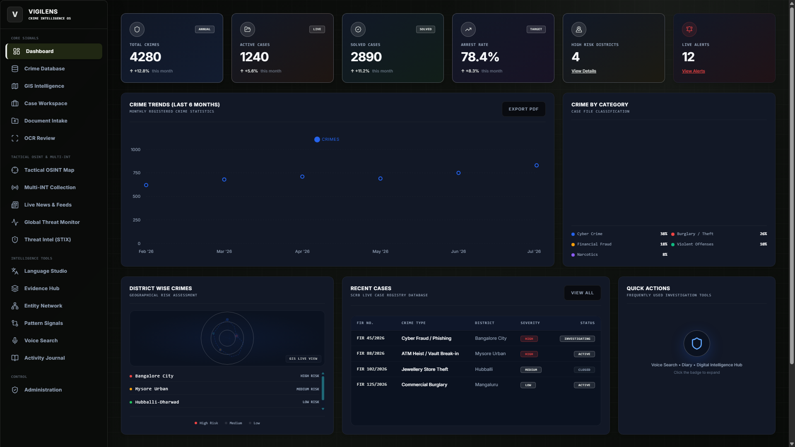
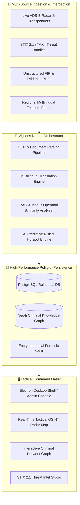
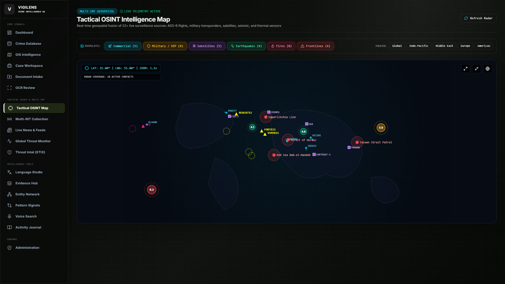
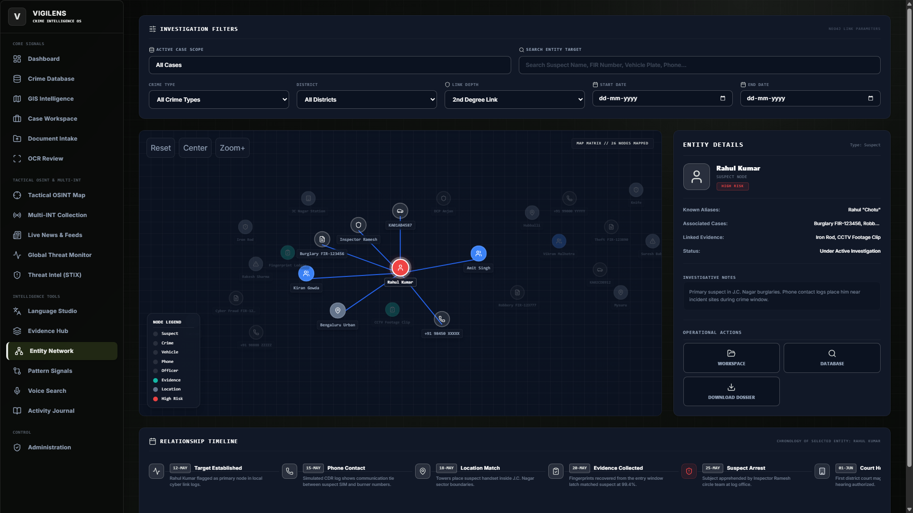
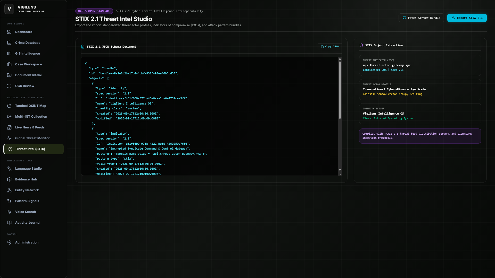
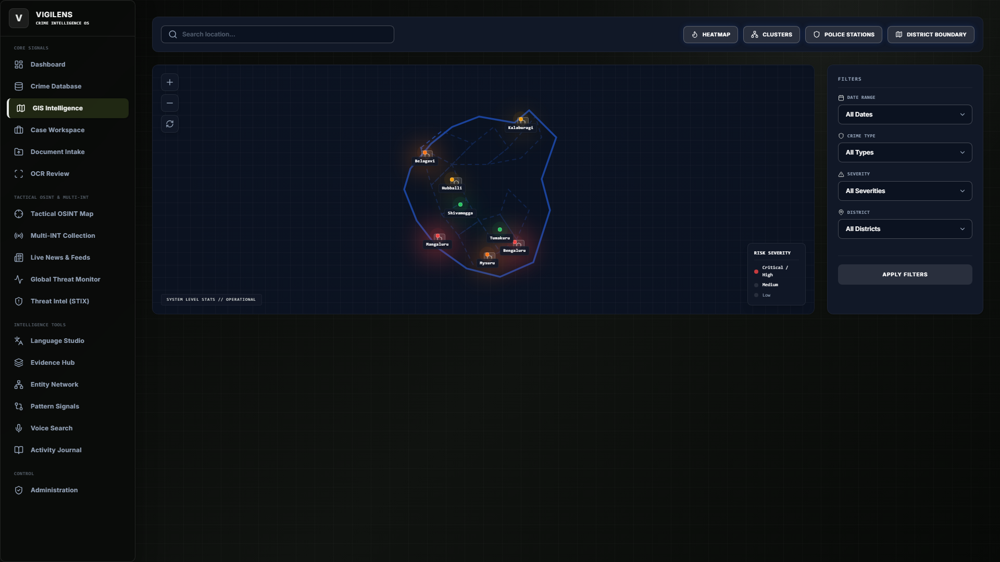
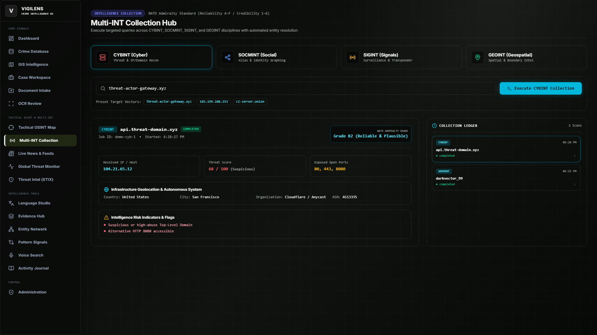
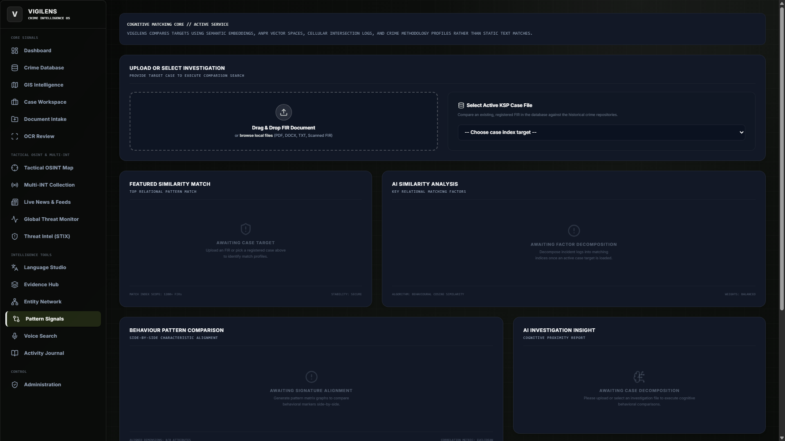
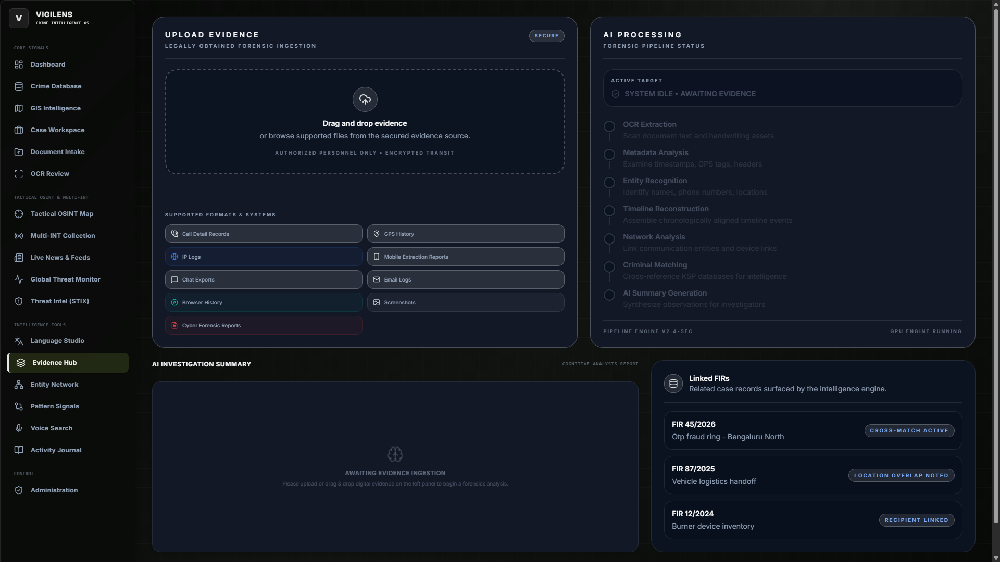
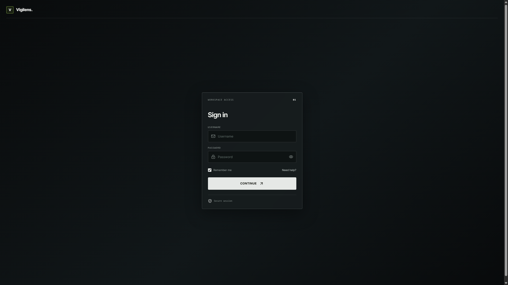

<div align="center">

# 🛡️ V I G I L E N S
### Autonomous Tactical Defense & Cyber-Forensic Crime Intelligence Operating System

[](https://github.com/seyric/vigilens)
[](https://electronjs.org)
[](https://fastapi.tiangolo.com)
[](https://react.dev)
[](https://neo4j.com)
[](https://postgresql.org)

<br />

**Vigilens** is a state-of-the-art, air-gapped capable Crime Intelligence & Tactical Defense Operations Platform designed for law enforcement, defense intelligence analysts, and national security command centers. It bridges raw operational telemetry, multi-sensor open-source intelligence (OSINT), graph-based criminal networks, and multi-model Generative AI into a unified situational awareness command matrix.

<br />



</div>

---

## ⚡ Executive Mission & Tactical Architecture

Traditional law enforcement records systems suffer from information silos, sluggish manual docket parsing, and disconnected communication logs. **Vigilens** resolves these bottlenecks by combining real-time OSINT interception, automated forensic extraction, and graph neural network relationship mapping into a zero-trust, desktop-first architecture.



---

## 🛰️ Core Tactical Pillars

### 1. Tactical OSINT & Geospatial Radar Map
Fused live telemetry streaming from over 23+ real-time intelligence feeds: ADS-B transponder flight tracking (military VIP and commercial aircraft), satellite orbital passes, regional seismic hazards, thermal hotspot detection, and tactical maritime/conflict frontlines.



* **Real-time Radar Interception**: Monitor airspace and maritime bottlenecks (e.g., Strait of Hormuz, Bab-el-Mandeb, Taiwan Strait).
* **Multi-Layer Vector Filtering**: Toggle commercial flights, military assets, satellite passes, and active conflict lines dynamically.
* **Incident Geofencing**: Automatic coordinate proximity matching between ground-level crimes and airborne assets.

---

### 2. Neo4j Criminal Network Analysis & Entity Graphing
Deep entity resolution mapping the invisible connections between suspects, co-conspirators, burn phones, seized vehicles, illicit transactions, and physical evidence lockers.



* **N-Degree Link Traversals**: Explore 1st, 2nd, and 3rd-degree associate hops around primary target persons of interest.
* **Forensic Dossier Inspector**: Instant suspect dossiers including known aliases, active arrest warrants, and evidence chains.
* **Interactive Relationship Timeline**: Chronological event mapping from initial surveillance to apprehension.

---

### 3. STIX 2.1 Threat Intel Studio & Cyber Defense Matrix
Full interoperability with OASIS Open CTI standards. Ingest, author, validate, and export machine-readable STIX 2.1 bundles, Indicators of Compromise (IoCs), and MITRE ATT&CK campaign graphs.



* **TAXII 2.1 Integration**: Connect upstream intelligence sharing feeds directly to internal law enforcement investigations.
* **JSON Schema Verification**: Real-time syntax validation for threat actor profiles, intrusion sets, and malware telemetry.
* **1-Click STIX Export**: Generate compliant threat bundles ready for national CERT and SIEM/SOAR pipelines.

---

### 4. GIS Geospatial Hotspot & Cluster Intelligence
Macro and micro geographic risk assessments with high-density heatmaps, spatial cluster groupings, and police station jurisdiction overlays.



* **Density Kernel Heatmaps**: Identify geographic crime clustering across metropolitan districts.
* **Jurisdictional Boundary Layers**: Real-time station resource allocation and boundary risk scoring.
* **Temporal Filtering**: Longitudinal temporal progression across quarters, months, and hours of the day.

---

### 5. Multi-INT Signals & Live Threat Collection
Consolidate Open Source Intelligence (OSINT), Human Intelligence (HUMINT), Signals Intelligence (SIGINT), and Geospatial Intelligence (GEOINT) in one unified dashboard.



* **Automated Data Collectors**: Configurable telemetry scrapers for public safety broadcasts and flight feeds.
* **Entity Watchlists**: Instant alerting when high-risk individuals or registered serial numbers ping regional sensors.
* **Threat Feed Hub**: Centralized triage for incoming alerts across active investigation units.

---

### 6. AI Crime Pattern Similarity & Modus Operandi Matching
Powered by semantic vector embeddings and LLM reasoning engines (Ollama, Google Gemini, Grok) to detect recurring operational patterns across seemingly unrelated cases.



* **Cross-Jurisdiction MO Matching**: Detect identical burglary methods, cyber scam scripts, or vehicle heist patterns across state boundaries.
* **Automated FIR Summarization**: Summarize lengthy First Information Reports into actionable intelligence briefs.
* **Confidence Scoring**: Multi-factor similarity weights accounting for time delta, geographic radius, and perpetrator tactics.

---

### 7. Digital Intelligence & Forensics Hub
Secure evidence ledger designed for chain-of-custody tracking, document extraction, and digital artifact forensic ingestion.



* **OCR Document Review**: Extract and normalize handwritten police diaries, vehicle registration slips, and court warrants.
* **Cryptographic Session Signing**: Every evidence ingestion event is cached with authorized officer identity records.
* **Forensic Ledger Integration**: Tamper-evident session history for court-admissible audit trails.

---

### 8. Air-Gapped Desktop Deployment & Zero-Trust Authentication
Engineered with hardware security at the forefront. Vigilens can operate in secure, air-gapped military/police network environments without external cloud dependencies.



* **Physical USB Hardware Key Locking**: Optional cryptographic hardware dongle verification (`USB_KEY_SHA256`) that blocks application startup unless an authorized hardware token is inserted.
* **Local PyInstaller Microservice**: Completely self-contained backend server binary bundled inside the Electron desktop executable.
* **Role-Based Operational Access**: Strict role segmentation for Field Officers, Senior Investigators, and Command Administrators.

---

## 🛠️ Technology Stack Breakdown

| Subsystem | Technologies Used |
| :--- | :--- |
| **Desktop Shell** | Electron 35, Node.js, Windows Win32 Shell API, PyInstaller |
| **User Interface** | React 19, TypeScript, Vite, Tailwind CSS 4, Lucide Icons, Recharts |
| **Backend API** | Python 3.12+, FastAPI, Uvicorn, Pydantic v2, PyJWT, Argon2 |
| **Knowledge Graph** | Neo4j Graph Database 5.x, Cypher Query Language |
| **Relational Storage** | PostgreSQL 16+ (Neon Cloud / Local Instance), SQLAlchemy 2.0 |
| **Intelligence Standards** | OASIS STIX 2.1, TAXII 2.1, ADS-B Flight Telemetry |
| **AI & Neural NLP** | Ollama (Local Llama 3 / Mistral), Google Gemini Flash, Grok API |
| **Geospatial & GIS** | GeoPandas, Shapely, Turf.js, High-DPI Canvas Rendering |
| **Document Processing** | PyMuPDF (fitz), EasyOCR, Tesseract, Pillow |

---

## 🚀 Quickstart & Installation

### System Prerequisites
* **Operating System**: Windows 10/11 (64-bit) or Linux (Ubuntu 22.04+)
* **Node.js**: v18.0.0 or higher
* **Python**: v3.12.0 or higher
* **PostgreSQL & Neo4j**: Running locally or reachable over private network

### 1. Repository Clone & Setup
```bash
git clone https://github.com/seyric/vigilens.git
cd vigilens
```

### 2. Environment Configuration
Copy the template configuration file:
```bash
copy .env.example .env
```

Configure your operational parameters in `.env`:
```env
# AI Intelligence Provider (ollama | gemini | grok)
AI_PROVIDER=ollama
OLLAMA_BASE_URL=http://localhost:11434
OLLAMA_MODEL=llama3:8b

# Core Cryptographic Key
SECRET_KEY=generate-a-strong-32-character-secret-key-here

# Relational Database (PostgreSQL)
POSTGRES_HOST=localhost
POSTGRES_PORT=5432
POSTGRES_DB=vigilens
POSTGRES_USER=postgres
POSTGRES_PASSWORD=your_secure_password

# Graph Database (Neo4j)
NEO4J_URI=bolt://localhost:7687
NEO4J_USER=neo4j
NEO4J_PASSWORD=your_neo4j_password

# Hardware Security Token (Optional)
USB_KEY_REQUIRED=false
USB_KEY_PATH=E:\vigilens.key
USB_KEY_SHA256=
```

### 3. Backend Initialization
```bash
python -m venv .venv
.venv\Scripts\activate
pip install -r requirements.txt
uvicorn backend.main:app --host 127.0.0.1 --port 8000 --reload
```
* Interactive API Documentation: `http://127.0.0.1:8000/docs`

### 4. Frontend Launch
In a separate terminal:
```bash
npm install
npm run dev
```
* Web Dashboard: `http://127.0.0.1:5173/`

### 5. Running Desktop Shell (Full-Screen Tactical Mode)
```bash
npm run desktop:dev
```

### 6. Running Administrative Console
```bash
npm run admin:dev
```

---

## 📦 Production Desktop Packaging

Vigilens can be compiled into a standalone, single-file Windows installer that packs both the Python server runtime and the Electron interface:

```bash
# 1. Compile backend into dist-server/vigilens-server.exe
npm run server:build

# 2. Package complete Electron distribution
npm run desktop:build
```
The resulting executable installer will be generated in `release/`.

---

## 🔒 Security & Defense Compliance

* **Zero Cloud Telemetry**: All analytical processing can run 100% on local hardware using Ollama and local PostgreSQL/Neo4j nodes.
* **Air-Gap Readiness**: Zero external phone-home requests in disconnected deployment mode.
* **Cryptographic Token Storage**: User sessions are authenticated using Argon2 password hashing and signed HS256 JWT bearer credentials.
* **Audit Trail Accountability**: All evidence accesses, suspect dossier views, and STIX exports generate immutable audit log events.

---

## ⚖️ License & Author

Engineered by **[Seyric](https://github.com/seyric)**.

Licensed under the **MIT License**. See [LICENSE](LICENSE) for complete terms.
All trademarks, project assets, and interface designs are proprietary to the Vigilens Project.
